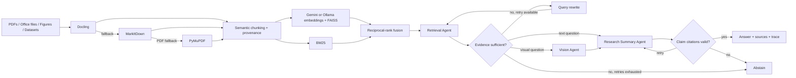

# BioRAG

[](https://github.com/AE-0001/BioRAG/actions/workflows/ci.yml)

Multimodal, multi-agent retrieval-augmented generation for biomedical research
literature. BioRAG ingests papers, figures, tables, and supplementary datasets,
then produces evidence-bound answers with page-level citations and an auditable
LangGraph execution trace.

> Research prototype only. BioRAG does not provide medical advice, diagnosis,
> or treatment recommendations.

## Verified evaluation snapshot

| Benchmark | Result |
|---|---:|
| Labelled known-item queries | 30 |
| Evaluation corpus | 50 PDFs / 1,046 pages / 1,318 chunks |
| Hit@5 | 73.3% |
| MRR@5 | 0.661 |
| nDCG@5 | 0.680 |
| Query latency | 2.224 s p50 / 2.333 s p95 |
| Automated tests | 128 passing / 79% coverage |

The dataset, locked paper manifest, per-query outputs, and methodology are committed
in [`evaluation/`](evaluation/); see the
[30-query report](evaluation/reports/retrieval_30q_50papers.md). These are retrieval metrics,
not clinical or answer-accuracy claims.

## Why this architecture

Biomedical retrieval needs semantic similarity, exact vocabulary, and honest
failure behavior. BioRAG supports either Gemini embeddings or fully local
Ollama neural embeddings in FAISS, fused with BM25 using reciprocal-rank
fusion. Docling is the primary layout-aware parser, MarkItDown is the fast
document fallback, and PyMuPDF is the final portable PDF degradation path.
Generation is independently selectable: local Qwen through Ollama, Gemini, or OpenRouter.



| Agent | Responsibility | Failure it controls |
|---|---|---|
| Retrieval | Hybrid search and evidence selection | Missed terminology or semantic matches |
| Vision | Align retrieved figures with captions and paper context | Treating visual evidence as detached text |
| Research Summary | Synthesize only from supplied evidence | Unsupported biomedical claims |
| Citation | Validate citation markers and provenance | Invalid or missing sources |

LangChain-compatible embedding interfaces provide interchangeable components.
LangGraph provides typed state, node ordering, tracing, and a path to persistence
or human review.

## Capabilities

- Layout-aware PDF parsing and scanned-document OCR
- Figure and table extraction with paper/page provenance
- CSV, TSV, JSON, and Excel supplementary dataset ingestion
- Semantic chunking and idempotent indexing
- Gemini or Ollama neural embeddings with persistent, provider-validated FAISS
- BM25 + semantic reciprocal-rank fusion
- Conditional LangGraph with evidence grading, query correction, visual routing,
  citation retry, and abstention
- Ollama/Qwen local generation, Gemini, or OpenRouter evidence-constrained generation
- Prometheus counters, gauges, and latency histograms
- FastAPI upload, ingestion, search, Q&A, health, and metrics APIs
- Streamlit research interface
- Docker packaging and automated evaluation

## Quick start

Prerequisites: Python 3.11. For the fully local path, install Ollama; a Gemini
API key is required only when Gemini or OpenRouter is selected.

```bash
python -m venv .venv
# Windows
.\.venv\Scripts\activate
python -m pip install -e ".[ui,dev]"
copy .env.example .env
```

For local neural retrieval and generation:

```powershell
ollama pull qwen3:4b
ollama pull nomic-embed-text
$env:BIORAG_EMBEDDING_PROVIDER = "ollama"
$env:BIORAG_GENERATION_PROVIDER = "ollama"
```

Qwen3 4B is the local cited-answer model. It is substantially stronger than the
original 0.5B smoke-test model while remaining practical on a student laptop.
Generation can still be switched independently to Gemini.

Then run:

```bash
uvicorn biorag.api:app --reload
streamlit run app.py
```

Open `http://localhost:8000/docs` for the API contract and
`http://localhost:8501` for the interface.

### End-to-end demo

The bundled demonstration corpus contains text, a figure manifest, and
supplementary tabular data. It lets you exercise ingestion, neural retrieval,
grounded answering, citations, and the agent trace with the configured providers:

```powershell
biorag demo
uvicorn biorag.api:app --reload
streamlit run app.py
```

The demo is intentionally small and synthetic. It is for reproducibility and
tests, not evidence of the scale claimed by a production corpus run.

To use Gemini, select the Gemini embedding and/or generation provider and configure
`GEMINI_API_KEY`. There is no product-facing deterministic offline mode.
To use OpenRouter generation, configure `OPENROUTER_API_KEY`; optionally set
`BIORAG_OPENROUTER_MODEL` (the default is `openrouter/auto`).

### Open-access corpus benchmark

The repository does not commit research PDFs. Download the listed open-access
PMC packages locally, then run a benchmark to create a truthful metrics report:

```powershell
python scripts/download_pmc_corpus.py
python scripts/lock_corpus.py
python evaluation/run_retrieval_benchmark.py
```

The versioned manifest contains 50 open-access PMC papers (1,046 pages and 7,734
page-preserving semantic chunks). The retrieval benchmark parses
all papers quickly with PyMuPDF, gives Gemini and Ollama the exact same chunks, and
writes a committed report under `evaluation/reports/`. Docling is evaluated on a
representative layout-heavy subset because full layout, table, OCR, and figure
analysis is intentionally much more expensive than text extraction.

## API examples

```bash
curl -X POST http://localhost:8000/documents/upload \
  -F "files=@paper.pdf" \
  -F "files=@supplementary.csv"

curl "http://localhost:8000/search?q=What%20biomarkers%20predict%20response&top_k=5"

curl -X POST http://localhost:8000/ask \
  -H "Content-Type: application/json" \
  -d '{"question":"What limitations affect the reported association?","top_k":5}'
```

## Evaluation and truthful scale reporting

```bash
python evaluation/run_eval.py
pytest
curl http://localhost:8000/stats
curl http://localhost:8000/metrics
```

`/stats` reports indexed corpus counts. `/metrics` exposes Prometheus-format
operational metrics; Prometheus runs on port 9090 in the Compose stack.

Primary evaluation metrics are Recall@K, mean reciprocal rank, citation
precision/coverage, unsupported-claim rate, multimodal retrieval accuracy,
indexing throughput, and p50/p95 query latency.

The automated QA suite currently exercises API contracts and invalid inputs,
safe upload filenames, persistence and idempotency, BM25/FAISS ranking,
reciprocal-rank fusion, PDF and dataset ingestion, multimodal agent routing,
citation failure modes, CLI behavior, and deterministic component tests. CI enforces a
79% whole-package line-coverage floor; external Docling model execution and live
Gemini calls remain separately gated integration tests rather than mocked as
production proof.

## Repository map

```text
src/biorag/
  docling_ingestion.py  layout, OCR, tables, figures
  chunking.py           semantic evidence units
  gemini.py             embeddings and grounded generation
  local_ai.py           Ollama embeddings and Qwen generation
  markitdown_ingestion.py fast fallback document conversion
  observability.py      Prometheus instrumentation
  faiss_store.py        persistent semantic index
  retrieval.py          lexical BM25 retrieval
  hybrid.py             reciprocal-rank fusion
  graph.py              production four-agent LangGraph
  api.py                FastAPI services
app.py                  Streamlit interface
evaluation/             retrieval and grounding evaluation
tests/                  unit and graph contract tests
```

## Engineering boundaries

- Uploaded literature may contain copyrighted or sensitive information.
  Deployments must enforce authorization, retention, and content rights.
- Answers are research summaries, not clinical decisions.
- Association is not presented as causation.
- A valid citation marker proves formatting, not scientific truth; production
  review should additionally run claim-evidence entailment and human review.
- Hunyuan is not included merely as a brand name. Add it behind the provider
  interface only after selecting and evaluating an exact model and purpose.
- `IndexFlatIP` is exact and appropriate at the resume’s stated scale. At much
  larger scale, benchmark IVF/HNSW or a managed vector service.

## License

MIT. Third-party models, papers, and datasets retain their own licenses.
