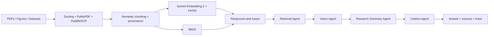

# BioRAG

Multimodal, multi-agent retrieval-augmented generation for biomedical research
literature. BioRAG ingests papers, figures, tables, and supplementary datasets,
then produces evidence-bound answers with page-level citations and an auditable
LangGraph execution trace.

> Research prototype only. BioRAG does not provide medical advice, diagnosis,
> or treatment recommendations.

## Why this architecture

Biomedical retrieval needs both semantic similarity and exact vocabulary.
BioRAG therefore combines Gemini multimodal embeddings in FAISS with BM25
lexical retrieval using reciprocal-rank fusion. Docling preserves document
layout, PyMuPDF provides PDF primitives, and PP-OCRv5 is invoked selectively
when layout parsing cannot recover usable text from a scanned page.
The four agents have narrow responsibilities:



| Agent | Responsibility | Failure it controls |
|---|---|---|
| Retrieval | Hybrid search and evidence selection | Missed terminology or semantic matches |
| Vision | Align retrieved figures with captions and paper context | Treating visual evidence as detached text |
| Research Summary | Synthesize only from supplied evidence | Unsupported biomedical claims |
| Citation | Validate citation markers and provenance | Invalid or missing sources |

LangChain-compatible embedding interfaces provide interchangeable components.
LangGraph provides typed state, node ordering, tracing, and a path to persistence
or human review.

## Capabilities

- Layout-aware PDF parsing and scanned-document OCR
- Figure and table extraction with paper/page provenance
- CSV, TSV, JSON, and Excel supplementary dataset ingestion
- Semantic chunking and idempotent indexing
- Gemini Embedding 2 and persistent FAISS cosine search
- BM25 + semantic reciprocal-rank fusion
- Compiled four-agent LangGraph
- Gemini evidence-constrained answer generation
- FastAPI upload, ingestion, search, Q&A, health, and metrics APIs
- Streamlit research interface
- Docker packaging and automated evaluation

## Quick start

Prerequisites: Python 3.11 and a Gemini API key. PyMuPDF is the portable
default PDF extractor; Docling/PaddleOCR is an optional layout/OCR engine.

```bash
python -m venv .venv
# Windows
.\.venv\Scripts\activate
python -m pip install -e ".[ui,dev]"
copy .env.example .env
```

Set `GEMINI_API_KEY` in your environment, then:

```bash
uvicorn biorag.api:app --reload
streamlit run app.py
```

Open `http://localhost:8000/docs` for the API contract and
`http://localhost:8501` for the interface.

For a credential-free smoke test, set `BIORAG_MODE=offline`. This uses a
deterministic local test double; it is not the production retrieval backend.

### Offline end-to-end demo

The bundled demonstration corpus contains text, a figure manifest, and
supplementary tabular data. It lets you exercise ingestion, retrieval,
grounded answering, citations, and the agent trace without an API key:

```powershell
$env:BIORAG_MODE = "offline"
biorag demo
uvicorn biorag.api:app --reload
streamlit run app.py
```

The demo is intentionally small and synthetic. It is for reproducibility and
tests, not evidence of the scale claimed by a production corpus run.

For an API-key-backed CLI run, use `biorag --production demo` after configuring
`GEMINI_API_KEY`.

### Open-access corpus benchmark

The repository does not commit research PDFs. Download the listed open-access
PMC packages locally, then run a benchmark to create a truthful metrics report:

```powershell
python evaluation/run_corpus_benchmark.py --corpus data/corpus/pdfs
```

Place PDFs you have downloaded legally into `data/corpus/pdfs/`; manual
download is recommended because PMC can block automated PDF requests.

Add `--production` to benchmark Gemini embeddings and the FAISS index. The
generated metrics JSON is ignored by Git by default, so it never turns a local
corpus run into an unsupported public scale claim.

## API examples

```bash
curl -X POST http://localhost:8000/documents/upload \
  -F "files=@paper.pdf" \
  -F "files=@supplementary.csv"

curl "http://localhost:8000/search?q=What%20biomarkers%20predict%20response&top_k=5"

curl -X POST http://localhost:8000/ask \
  -H "Content-Type: application/json" \
  -d '{"question":"What limitations affect the reported association?","top_k":5}'
```

## Evaluation and truthful scale reporting

```bash
python evaluation/run_eval.py
pytest
curl http://localhost:8000/metrics
```

`/metrics` reports actual papers, figures, tables, supplementary rows, and
chunks in the persisted index.

Primary evaluation metrics are Recall@K, mean reciprocal rank, citation
precision/coverage, unsupported-claim rate, multimodal retrieval accuracy,
indexing throughput, and p50/p95 query latency.

## Repository map

```text
src/biorag/
  docling_ingestion.py  layout, OCR, tables, figures
  chunking.py           semantic evidence units
  gemini.py             embeddings and grounded generation
  faiss_store.py        persistent semantic index
  retrieval.py          BM25/offline test double
  hybrid.py             reciprocal-rank fusion
  graph.py              production four-agent LangGraph
  api.py                FastAPI services
app.py                  Streamlit interface
evaluation/             retrieval and grounding evaluation
tests/                  unit and graph contract tests
```

## Engineering boundaries

- Uploaded literature may contain copyrighted or sensitive information.
  Deployments must enforce authorization, retention, and content rights.
- Answers are research summaries, not clinical decisions.
- Association is not presented as causation.
- A valid citation marker proves formatting, not scientific truth; production
  review should additionally run claim-evidence entailment and human review.
- `IndexFlatIP` is exact and appropriate at the resume’s stated scale. At much
  larger scale, benchmark IVF/HNSW or a managed vector service.

## License

MIT. Third-party models, papers, and datasets retain their own licenses.
